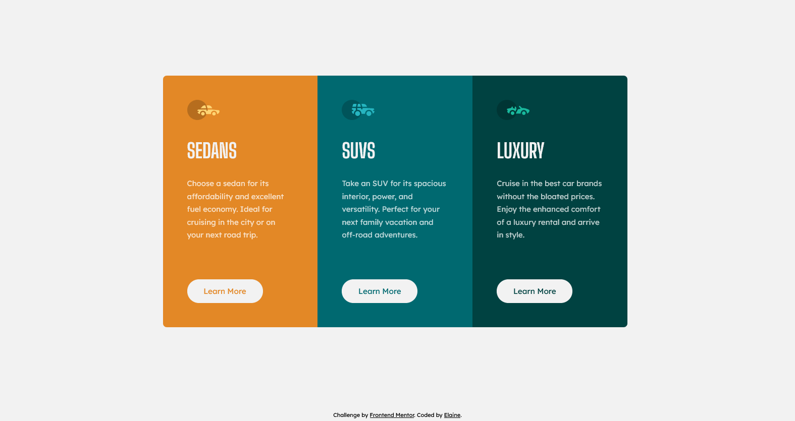

# Frontend Mentor - 3-column preview card component solution

This is a solution to the [3-column preview card component challenge on Frontend Mentor](https://www.frontendmentor.io/challenges/3column-preview-card-component-pH92eAR2-). Frontend Mentor challenges help you improve your coding skills by building realistic projects.

## Table of contents

- [Overview](#overview)
  - [The challenge](#the-challenge)
  - [Screenshot](#screenshot)
  - [Links](#links)
- [My process](#my-process)
  - [Built with](#built-with)
  - [What I learned](#what-i-learned)
  - [Continued development](#continued-development)
  - [Useful resources](#useful-resources)
- [Author](#author)
- [Acknowledgments](#acknowledgments)

## Overview

### The challenge

Users should be able to:

- View the optimal layout depending on their device's screen size
- See hover states for interactive elements

### Screenshot

### Links

- Solution URL: [Link to GitHub repo](https://github.com/elaineleung/frontendmentor/tree/main/3columnpreview)
- Live Site URL: [Link to live site](https://elaineleung.github.io/frontendmentor/3columnpreview/)

## My process

### Built with

- Semantic HTML5 markup
- CSS custom properties
- Flexbox
- CSS Grid
- Mobile-first workflow

### What I learned

This was a fairly easy challenge, and I managed to use something I newly learned, which is declaring custom properties directly in a selector (thanks to one of Kevin Powell's tutorials).

### Continued development

Not sure where I would use this yet, but I'm sure this would be good in a services section.

### Useful resources

- [Kevin Powell: "Write SO MUCH less CSS by using custom properties like this"](https://youtu.be/Wyc2hJZ_W8o) - This helped to simplify my code a bit when styling buttons.

## Author

- Frontend Mentor - [@elaineleung](https://www.frontendmentor.io/profile/elaineleung)
- Twitter - [@elaineclleung](https://twitter.com/elaineclleung)

## Acknowledgments

Thank you to Kevin Powell for the superb tutorials as usual!
