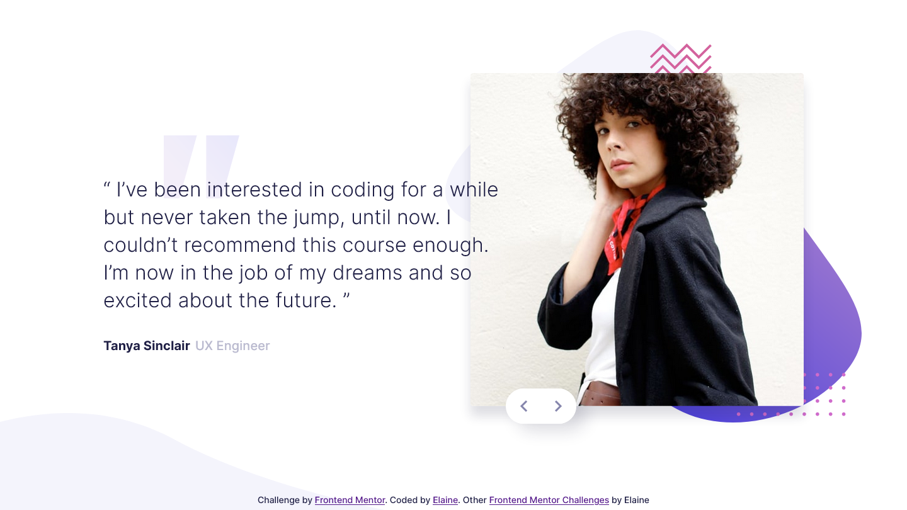

# Frontend Mentor - Coding bootcamp testimonials slider solution

This is a solution to the [Coding bootcamp testimonials slider challenge on Frontend Mentor](https://www.frontendmentor.io/challenges/coding-bootcamp-testimonials-slider-4FNyLA8JL). Frontend Mentor challenges help you improve your coding skills by building realistic projects. 

## Table of contents

- [Overview](#overview)
  - [The challenge](#the-challenge)
  - [Screenshot](#screenshot)
  - [Links](#links)
- [My process](#my-process)
  - [Built with](#built-with)
  - [What I learned](#what-i-learned)
  - [Continued development](#continued-development)
  - [Useful resources](#useful-resources)
- [Author](#author)

## Overview

### The challenge

Users should be able to:

- View the optimal layout for the component depending on their device's screen size
- Navigate the slider using either their mouse/trackpad or keyboard

### Screenshot

### Links

- Solution URL: [Link to solution URL](https://www.frontendmentor.io/solutions/responsive-image-slidercarousel-built-with-scss-and-plain-js-aTsBq6SGAo)
- Live Site URL: [Link to live site](https://elaineleung.github.io/frontendmentor/codingbootcamptestimonials/)
## My process

### Built with

- Semantic HTML5 markup
- CSS custom properties
- Flexbox
- CSS Grid
- Mobile-first workflow

### What I learned

I've made a slider before for a Scrimba challenge, and so I mainly reused my old code. The most difficult part of this challenge was actually positioning the elements so that they can still be in place while the browser size changes. Not only that, some SVGs change their size depending on view. The main graphic behind the image was hardest to get right, and it was only when I realized it was positioned in the center of the images that things became a bit easier. I had to rewrite my CSS a few times just to get the positions right. I'm really not a fan of these positioning exercises and would much rather work on the Javascript, but I realize this is all a part of the design. I just don't know how much it's worth it to spend a few hours positioning three SVG elements. If I were designing this, I honestly wouldn't bother.

Everything else was fairly straightforward, especially wiring up the buttons with the keys, and I was able to reuse the knowledge I learned in the recent challenge I completed.

### Continued development

One thing I'd like to continue working on is the animation of the text when transitioning. I tried using classes, but it's a bit more complicated than I thought because the nodes are being appended, and so I might need to access pseudo classes in the JS to access the children.

### Useful resources

[Key values for keyboard events](https://developer.mozilla.org/en-US/docs/Web/API/UI_Events/Keyboard_event_key_values) - This is a good reference for keyboard events.

[How to build a more accessible carousel or slider](https://dev.to/jasonwebb/how-to-build-a-more-accessible-carousel-or-slider-35lp) - A good guideline/discussion on the key elements of an accessible carousel, the challenges in building one, and also dos and don'ts.

[If you must use a carousel, make it accessible](https://lsnrae.medium.com/if-you-must-use-a-carousel-make-it-accessible-977afd0173f4) - An explanation by Alison Walden on why how screen reader users use a carousel and the challenges they face in using one

## Author

- Frontend Mentor - [@elaineleung](https://www.frontendmentor.io/profile/elaineleung)
- Twitter - [@elaineclleung](https://twitter.com/elaineclleung)

