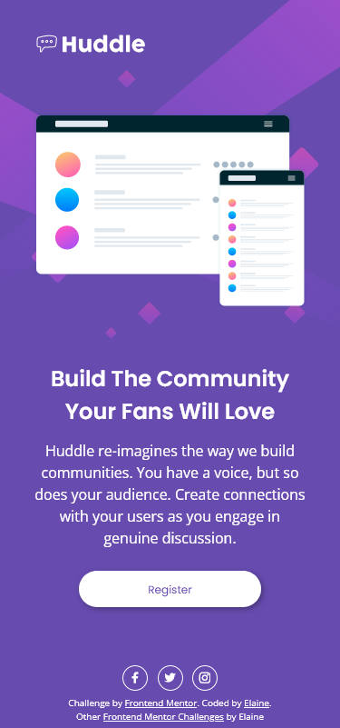
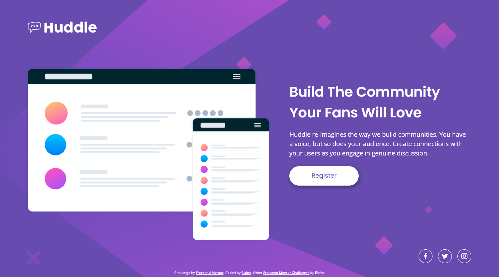

# Frontend Mentor - Huddle landing page with single introductory section solution

This is a solution to the [Huddle landing page with single introductory section challenge on Frontend Mentor](https://www.frontendmentor.io/challenges/huddle-landing-page-with-a-single-introductory-section-B_2Wvxgi0). Frontend Mentor challenges help you improve your coding skills by building realistic projects. 

## Table of contents

- [Overview](#overview)
  - [The challenge](#the-challenge)
  - [Screenshot](#screenshot)
  - [Links](#links)
- [My process](#my-process)
  - [Built with](#built-with)
  - [What I learned](#what-i-learned)
- [Author](#author)

## Overview

### The challenge

Users should be able to:

- View the optimal layout for the page depending on their device's screen size
- See hover states for all interactive elements on the page

### Screenshot

### Links

- Solution URL: [Link to solution URL](https://www.frontendmentor.io/solutions/landing-page-with-scss-bem-and-html-oFnvUpqYs8)
- Live Site URL: [Link to live site](https://elaineleung.github.io/frontendmentor/huddlelandingpage/)

## My process

### Built with

- Semantic HTML5 markup
- CSS custom properties
- Flexbox
- CSS Grid
- Mobile-first workflow
- BEM

### What I learned

This was more of a huge review of how to use SCSS with BEM. Some things I either got reminded of or learned in this process:

- One thing I need to keep in mind is to make sure to check and confirm the font size of the body before I work on the rest of the stylings, otherwise if I decide to change the font size, I might need to make a lot of other changes as well.

- I ended up changing the HTML structure and divs halfway, mainly because I failed to look at the desktop design before I started the mobile design. It would be good to do a bit more planning next time so that I wouldn't have to waste time redoing the structure.

- For the socials, I reused a component I made in another challenge, and that saved me a lot of time; plus it helped to have my memory refreshed in how I made that component.

## Author

- Frontend Mentor - [@elaineleung](https://www.frontendmentor.io/profile/elaineleung)
- Twitter - [@elaineclleung](https://twitter.com/elaineclleung)

