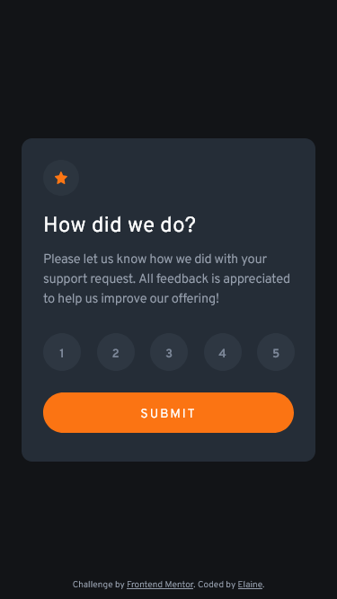
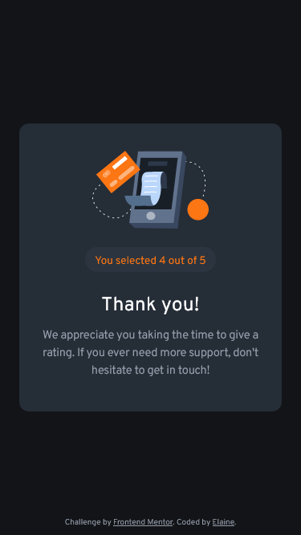

# Frontend Mentor - Interactive rating component solution

This is a solution to the [Interactive rating component challenge on Frontend Mentor](https://www.frontendmentor.io/challenges/interactive-rating-component-koxpeBUmI). Frontend Mentor challenges help you improve your coding skills by building realistic projects. 

## Table of contents

- [Overview](#overview)
  - [The challenge](#the-challenge)
  - [Screenshot](#screenshot)
  - [Links](#links)
- [My process](#my-process)
  - [Built with](#built-with)
  - [What I learned](#what-i-learned)
  - [Continued development](#continued-development)
  - [Useful resources](#useful-resources)
- [Author](#author)
- [Acknowledgments](#acknowledgments)


## Overview

### The challenge

Users should be able to:

- View the optimal layout for the app depending on their device's screen size
- See hover states for all interactive elements on the page
- Select and submit a number rating
- See the "Thank you" card state after submitting a rating

### Screenshot






### Links

- Solution URL: [Link to solution URL](https://www.frontendmentor.io/solutions/responsive-interactive-rating-component-SeBo-aR4gB)
- Live Site URL: [Link to live site](https://elaineleung.github.io/frontendmentor/interactiveratingcomponent/)

## My process

### Built with

- Semantic HTML5 markup
- CSS custom properties
- CSS Grid 
- Mobile-first workflow
- SASS (While I did use SASS, I found that it didn't make a big difference since I didn't have anything nested this time)

### What I learned

This is the first challenge I worked on after a long absence, so this was more of a much needed review for me. I was also able to pull from a lot of bits and pieces in other personal projects, such as my gradient generator project, which contained some code that was helpful for the JS for the rating portion in this challenge:

```js
const [...scoreBtns] = document.querySelectorAll(".rating__btn");
let selected = null;

scoreBtns.map((btn) => {
  btn.addEventListener("click", function (event) {
    selected = event.target.value;
    selectScore(selected);
  });
});

function selectScore(selected) {
  scoreBtns.forEach((btn) => {
    btn.classList.remove("btn__is-selected");
    if (btn.getAttribute("value") === selected) {
      btn.classList.add("btn__is-selected");
    }
  });
}
```

One point of reflection I have here is in form submission where instead of sending users to the next page, the DOM gets rewritten instead, and in this case it meant that the rating state would be overwritten by the thank you state. I first tried having both states in the HTML, with one state being hidden (i.e., thank you state), and the other being visible, then flipping over once the rating is submitted. While that worked, I didn't like the idea of the nodes of both states being still visible in the DOM once you pull up the inspector, even if the hidden state (i.e., having `display: none`) is in an inactive colored text. In the end, I opted to overwrite the element completely in JS. I'd be interested to find out what is considered best practice in this case, i.e., whether to have the code of both states in the HTML or to overwrite the DOM.

Another thing I did in this challenge is that for the CSS, I made sure to fully separate the typography from the structure as much as possible. Even if this meant repeating certain selectors, it was still easier this way to manage my workflow. I thought it was take more time since I haven't done much coding in a while and is therefore a bit rusty, but it still felt rather quick overall, so it does help tremendously to have a system in place.


### Continued development

This would be a good component to have when needing to rate services on a website (e.g., "Did you find what you wanted to look for?", "How easy was this site to navigate?")


### Useful resources

- [MDN Web Docs](https://developer.mozilla.org) - I used MDN as a reference for a few things here, such as HTML semantic and non-semantic elements as well as some methods for the DOM.

## Author

- Frontend Mentor - [@elaineleung](https://www.frontendmentor.io/profile/elaineleung)
- Twitter - [@elaineclleung](https://twitter.com/elaineclleung)

## Acknowledgments

I want to thank Matt from Frontend Mentor for the helpful comments and advice he gave me in my previous challenge, and I made sure to apply them to this challenege, even though those comments were well over half a year ago, I believe! Also, I want to thank myself for all the mini side projects I put together where I got to experiment and refactor a lot of the code I wrote :)