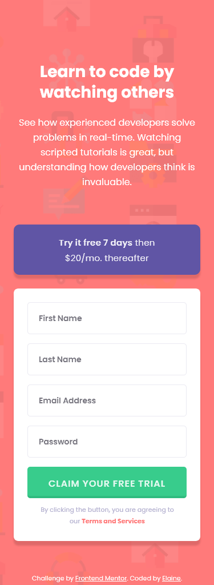
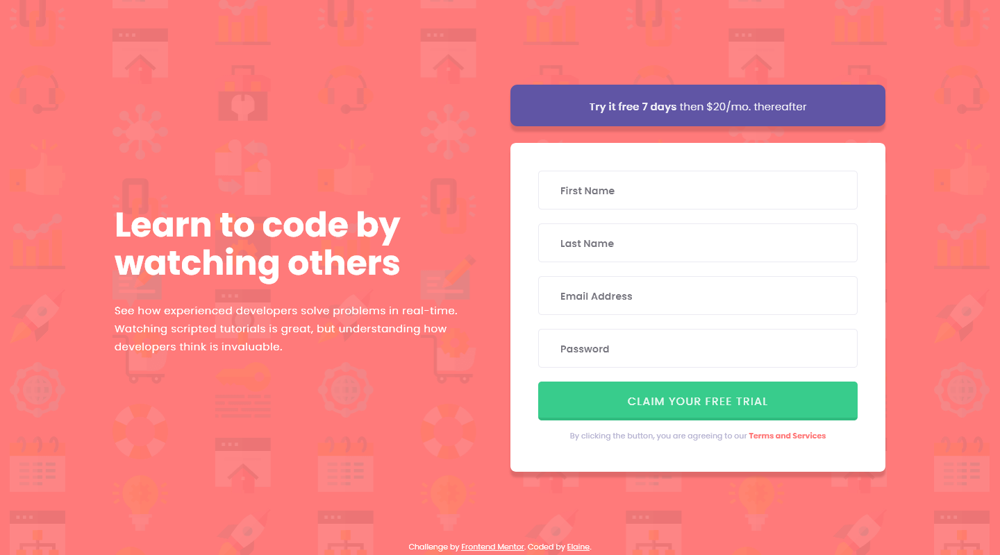

# Frontend Mentor - Intro component with sign up form solution

This is a solution to the [Intro component with sign up form challenge on Frontend Mentor](https://www.frontendmentor.io/challenges/intro-component-with-signup-form-5cf91bd49edda32581d28fd1). Frontend Mentor challenges help you improve your coding skills by building realistic projects. 

## Table of contents

- [Overview](#overview)
  - [The challenge](#the-challenge)
  - [Screenshot](#screenshot)
  - [Links](#links)
- [My process](#my-process)
  - [Built with](#built-with)
  - [What I learned](#what-i-learned)
  - [Continued development](#continued-development)
  - [Useful resources](#useful-resources)
- [Author](#author)
- [Acknowledgments](#acknowledgments)

## Overview

### The challenge

Users should be able to:

- View the optimal layout for the site depending on their device's screen size
- See hover states for all interactive elements on the page
- Receive an error message when the `form` is submitted if:
  - Any `input` field is empty. The message for this error should say *"[Field Name] cannot be empty"*
  - The email address is not formatted correctly (i.e. a correct email address should have this structure: `name@host.tld`). The message for this error should say *"Looks like this is not an email"*

### Screenshot






### Links

- Solution URL: [Link to GitHub repo](https://github.com/elaineleung/frontendmentor/tree/main/introcomponentwithform)
- Live Site URL: [Link to live site](https://elaineleung.github.io/frontendmentor/introcomponentwithform/)

## My process

### Built with

- Semantic HTML5 markup
- CSS custom properties
- Flexbox
- CSS Grid
- Mobile-first workflow
- SCSS

### What I learned

This was a multi-part challenge that took me a few days because I wanted to try something different. In the previous challenge, there was only email validation involved, and while my styling and structure worked, I felt there had to be a better way to have icons in form validation. In this challenge, I decided to learn how to do form validation the proper way, and it took a bit of experimentation. The main takeaway is learning how to use labels as placeholders and learning how to write `:invalid` and `:valid` with `not(:focus)` and `not(:placeholder-shown)`, like this:

```css
input {
  &:not(:focus):not(:placeholder-shown):valid,
  &:not(:focus):not(:placeholder-shown):invalid {
    background: inherit;
      & + label {
        opacity: 0;
      }
    }
}

```

This is the first challenge where I used SCSS because of the way I needed to write the pseudo classes. Quite a good exercise overall. 

I also ended up adding a post-form message after submitting the form.

### Continued development

After learning how to do proper client side validation, I may need to go back to my other apps and implement this!

### Useful resources

- [Form Validation](https://www.bram.us/2021/01/28/form-validation-you-want-notfocusinvalid-not-invalid/) - An excellent article by Bramus on the pseduo classes 
- [Form Validation UX in HTML and CSS](https://css-tricks.com/form-validation-ux-html-css/) - I started with this article, which was super helpful especially in using labels, icons, and more.


## Author

- Frontend Mentor - [@elaineleung](https://www.frontendmentor.io/profile/elaineleung)
- Twitter - [@elaineclleung](https://twitter.com/elaineclleung)


## Acknowledgments

Thank you to Mozilla Dev, CSS Tricks, and Bramus!
