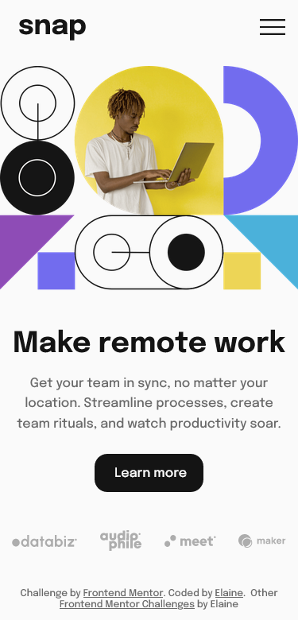
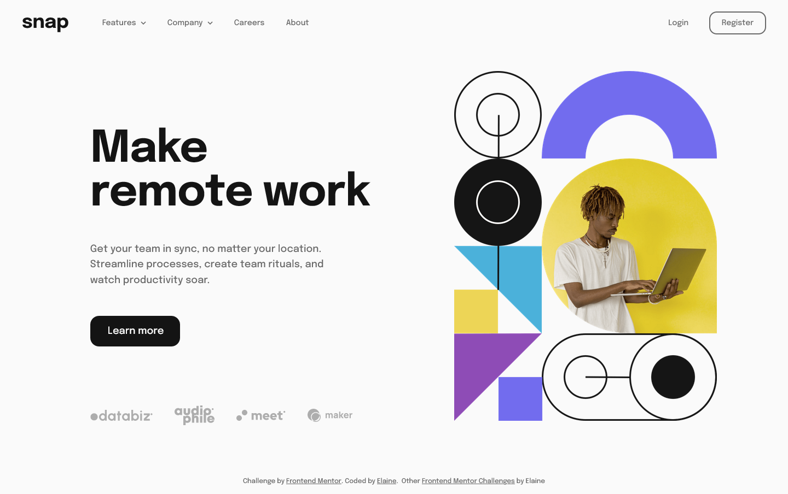

# Frontend Mentor - Intro section with dropdown navigation solution (with plain JS)

This is a solution to the [Intro section with dropdown navigation challenge on Frontend Mentor](https://www.frontendmentor.io/challenges/intro-section-with-dropdown-navigation-ryaPetHE5). Frontend Mentor challenges help you improve your coding skills by building realistic projects. 

## Table of contents

- [Overview](#overview)
  - [The challenge](#the-challenge)
  - [Screenshot](#screenshot)
  - [Links](#links)
- [My process](#my-process)
  - [Built with](#built-with)
  - [What I learned](#what-i-learned)
  - [Continued development](#continued-development)
  - [Useful resources](#useful-resources)
- [Author](#author)
- [Acknowledgments](#acknowledgments)

## Overview

### The challenge

Users should be able to:

- View the relevant dropdown menus on desktop and mobile when interacting with the navigation links
- View the optimal layout for the content depending on their device's screen size
- See hover states for all interactive elements on the page

### Screenshot

### Links

- Solution URL: [Link to solution URL](https://www.frontendmentor.io/solutions/landing-page-with-dropdown-nav-using-plain-js-9xR9e4TRV3)
- Live Site URL: [Link to live site](https://elaineleung.github.io/frontendmentor/introsecdropdownnav/)

## My process

### Built with

- Semantic HTML5 markup
- CSS custom properties
- Flexbox
- CSS Grid
- Mobile-first workflow
- SCSS

### What I learned

I built [another version of this challenge with React](https://fem-introsecdropdownnav.vercel.app/) where I was trying to brush up on my React skills while testing out CUBE CSS. While I got everything working with room for improvement, I know was pretty bloated due to all the components I decided to pin in, and I also didn't take the time to refactor my JS and clean up the CSS. When I saw a lot of people submitting this challenge, I decided to try this challenge again but with just JS. I started by building out [a small version on CodePen](https://codepen.io/elaineleung/pen/poLpzge), and then I started the project with the existing HTML and some of the Sass from the React project. It took me quite a while mainly due to trying to put in new code while cleaning up my old code at the same time; this ended up being quite a good exercise in seeing what to do when you need to work with existing code and how to add new things without breaking it. I also ended up putting in all the features I had wanted to add in my React project, and I'm pretty pleased with how things turn out just using plain JS. I also wanted to add more accessiblity features, and I think that was a good try also.

Here's what short list of features I added in this project (that I had wanted to add in the other one but didn't):
- Added `:focus` with outline to highlight links for users (Accessibility feature)
- Reworked dropnavs using a different structure and using `aria-expanded` (Accessibility feature)
- Added `setTimeout()` and JS logic to close navigation to simulate loading effect after clicking links
- Added dropdown nav and mobile nav animation/transitions

Here's a short list of things I relearned/newly learned:
- CSS transitions
- Using default parameters in JS
- Using `aria-expanded` for dropdown navs and `aria-pressed` for toggling
- Building an accessible dropdown menu.

### Continued development

List of updates:
- Aug 7, 2020: Fixed mobile nav bar issue

### Useful resources

- [Inclusive Menus & Menu Buttons](https://inclusive-components.design/menus-menu-buttons/) - Heydon Pickering's site was an excellent resource for me when I was trying explore how to make the site more accessible.

- [The mistake developers make when coding a hamburger menu](https://dev.to/tongrhj/the-mistake-developers-make-when-coding-a-hamburger-menu-1deg?signin=true) - This helped when I was fixing my mobile nav in my refactoring stage, and what Jared mentioned regarding the content in the background still being scrollable makes a lot of sense.

- [Stretching body to full viewport height: the missing way ](https://dev.to/fenok/stretching-body-to-full-viewport-height-the-missing-way-2ghd) - Still need to fully test out whether this works or not, but it's a good resource for trying to fix hidden footers on mobile devices.

## Author

- Frontend Mentor - [@elaineleung](https://www.frontendmentor.io/profile/elaineleung)
- Twitter - [@elaineclleung](https://twitter.com/elaineclleung)

## Acknowledgments

Credit goes to Kevin Powell for this new video series on building out an FEM challenge!