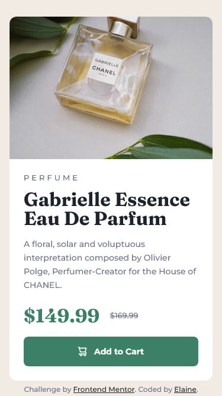
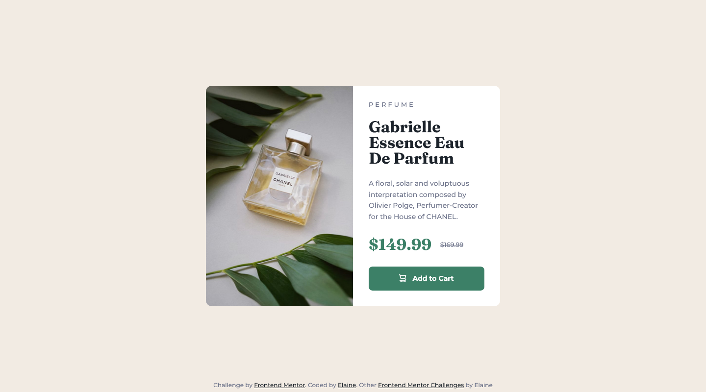

(Main repo is [located here](https://github.com/elaineleung/fem-introsecdropdownnav); this current repo is just for record keeping and may not have latest updates)

# Frontend Mentor - Product preview card component solution

This is a solution to the [Product preview card component challenge on Frontend Mentor](https://www.frontendmentor.io/challenges/product-preview-card-component-GO7UmttRfa). Frontend Mentor challenges help you improve your coding skills by building realistic projects. 

## Table of contents

- [Overview](#overview)
  - [The challenge](#the-challenge)
  - [Screenshot](#screenshot)
  - [Links](#links)
- [My process](#my-process)
  - [Built with](#built-with)
  - [What I learned](#what-i-learned)
  - [Useful resources](#useful-resources)
- [Author](#author)

## Overview

### The challenge

Users should be able to:

- View the optimal layout depending on their device's screen size
- See hover and focus states for interactive elements

### Screenshot

### Links

- Solution URL: [Link to GitHub repo](https://github.com/elaineleung/fem-introsecdropdownnav)
- Live Site URL: [Link to live site](https://fem-introsecdropdownnav.vercel.app/)
- Main Frontend Mentor repository: [Link to FEM repo](https://github.com/elaineleung/frontendmentor)

## My process

### Built with

- Semantic HTML5 markup
- CSS custom properties
- Flexbox
- CSS Grid
- Mobile-first workflow
- CUBE CSS
- Sass

### What I learned

In this challenge I tried write out all the HTML and CSS without using any old templates as a boilerplate. This is more of a refresher for me as well as an opportunity to try out CUBE CSS on a small component; I had used CUBE CSS for the first time in my previous challenge, which was one at the Junior level, and it took me some time to figure everything out. I decided to work on a Newbie challenge instead so that I can explore CUBE CSS a bit more fully. To my surprise, even without knowing the sizes of everything beforehand, writing everything was fairly quick, and styling it was even quicker. Having that said, there weren't as many changes from the mobile to desktop view as usual, and so that could have helped simplify everything. It also helped that I didn't fuss as much with the sizes as I normally do; I mainly tried to keep things to a decimal point if possible.

### Useful resources

- [CUBE CSS](https://piccalil.li/blog/cube-css/) - Andy Bell's post on CUBE CSS which helped me immensely in my previous challenge

## Author

- Frontend Mentor - [@elaineleung](https://www.frontendmentor.io/profile/elaineleung)
- Twitter - [@elaineclleung](https://twitter.com/elaineclleung)
