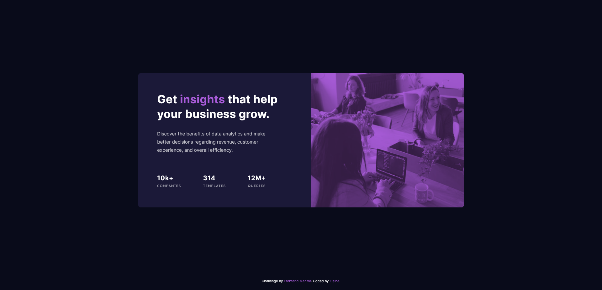

# Frontend Mentor: Stats preview card component solution

This is a solution to the [Stats preview card component challenge on Frontend Mentor](https://www.frontendmentor.io/challenges/stats-preview-card-component-8JqbgoU62). Frontend Mentor challenges help you improve your coding skills by building realistic projects.

## Table of contents

- [Overview](#overview)
  - [The challenge](#the-challenge)
  - [Screenshot](#screenshot)
  - [Links](#links)
- [My process](#my-process)
  - [Built with](#built-with)
  - [What I learned](#what-i-learned)
  - [Continued development](#continued-development)
  - [Useful resources](#useful-resources)
- [Author](#author)
- [Acknowledgments](#acknowledgments)

## Overview

### The challenge

Users should be able to:

- View the optimal layout depending on their device's screen size

### Screenshot




### Links

- Solution URL: [Link to solution URL](https://www.frontendmentor.io/solutions/mobilefirst-stats-preview-card-7goJJjaXN)
- Live Site URL: [Link to live site](https://elaineleung.github.io/frontendmentor/statspreview/)

## My process

### Built with

- Semantic HTML5 markup
- CSS custom properties
- Flexbox
- CSS Grid
- Mobile-first workflow

### What I learned

Although not having a reference design file is really time consuming, I felt it's actually better this way because I can use other ways to find the sizes I need, such as approximating proportions. However, the same can't really be said when it comes to colors. One of the challenges I encountered was when trying to figure how to do the overlay on the image because there are several ways to go about it, such as using a gradient, using blend mode, and also using a pseudo element. Even if I used an eyedropper tool, I still need to think about how to achieve this in CSS. In the end, I used a mix of blend mode plus a pseudo element to achieve the effect.

This is what I used:

```css
.card__image {
  width: 100%;
  height: 16em;
  background-color: var(--clr-accent);
  background-image: url("./images/image-header-mobile.jpg");
  background-blend-mode: multiply;
  background-size: cover;
  background-repeat: no-repeat;
  background-position: top;
  border-radius: 0.5em 0.5em 0 0;
  position: relative;
}

.card__image::before {
  border-radius: inherit;
  content: '';
  position: absolute;
  background-color: var(--clr-accent);
  opacity: 0.3;
  width: 100%;
  height: 100%;
}
```

This was good practice in using blend mode; I had to dig into my past lessons and try to recall where I used it before.

### Continued development

 This card component can be used for designing company websites.

### Useful resources

- [Build and deploy your portfolio](https://scrimba.com/learn/portfolio) - This was where I first learned how to use color overlay in CSS.

- [Background blend mode from CSS-Tricks](https://css-tricks.com/almanac/properties/b/background-blend-mode/) - This was a good refresher on blend modes.

- [Simple CSS Color Overlay](https://youtu.be/uLvhAJfx3T0) - I think this gave me the idea of combining several color properties together.

## Author

- Frontend Mentor - [@elaineleung](https://www.frontendmentor.io/profile/elaineleung)
- Twitter - [@elaineclleung](https://twitter.com/elaineclleung)

## Acknowledgments

Thank you to CSS-Tricks and also Kevin Powell for first teaching me about overlays!
