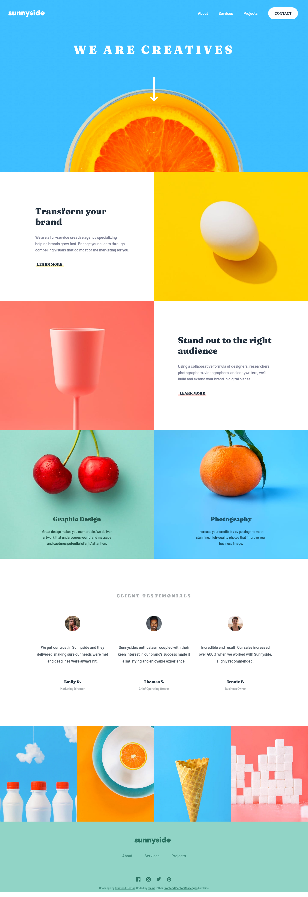

# Frontend Mentor - Sunnyside agency landing page solution

This is a solution to the [Sunnyside agency landing page challenge on Frontend Mentor](https://www.frontendmentor.io/challenges/sunnyside-agency-landing-page-7yVs3B6ef). Frontend Mentor challenges help you improve your coding skills by building realistic projects.

## Table of contents

- [Overview](#overview)
  - [The challenge](#the-challenge)
  - [Screenshot](#screenshot)
  - [Links](#links)
- [My process](#my-process)
  - [Built with](#built-with)
  - [What I learned](#what-i-learned)
  - [Continued development](#continued-development)
  - [Useful resources](#useful-resources)
- [Author](#author)
- [Acknowledgments](#acknowledgments)

## Overview

### The challenge

Users should be able to:

- View the optimal layout for the site depending on their device's screen size
- See hover states for all interactive elements on the page

### Screenshot




### Links

- Solution URL: [Link to GitHub repo](https://github.com/elaineleung/frontendmentor/tree/main/sunnysideagencylandingpage/)
- Live Site URL: [Link to live site](https://elaineleung.github.io/frontendmentor/sunnysideagencylandingpage/)

## My process

### Built with

- Semantic HTML5 markup
- CSS custom properties
- Flexbox
- CSS Grid
- Mobile-first workflow
- CUBE CSS
- SASS/SCSS

### What I learned

This sort of website is one of the first things I learned when I started web development, and back then it was about using `float` and there wasn't a mobile-first workflow approach either, but overtime thankfully I've picked up more useful tools such as flexbox, grid, BEM, and custom variables. 

Since this is a landing page and not a component, there's a much higher chance I could reuse the code here for future projects, and so I decided to use this challenge to learn how to approach basic landing pages differently than what I'm used to doing. That for me means learning the CUBE CSS methodology, and it also means "unlearning" a lot of what I've learned in the past, namely BEM, which I've gotten too used to. 

Here's a short, non-exhaustive list of useful things I learned in this challenge:

- `<ul role="list">` for things like `nav`
- responsive images in the HTML
- using `data-variant` for styling CSS
- how to properly use `clamp()`
- CUBE CSS (more on this later)

I recall that before I had learned about BEM, I was looking at another methodology called ITCSS (Inverted Triangle CSS), but it got too complicated for me, and there also wasn't enough resources around me to refer to at that time. When I heard about BEM, the methodology seemed simple enough, and that's what I have been using, despite its various shortcomings, such as not being able to fully utlize the inherent cascading nature of CSS. 

I found out about CUBE CSS through Kevin Powell, whose latest video series feature him working on an FEM challenge using the CUBE CSS approach, which was developed by Andy Bell. He also did a video where he coded a FEM component to demonstrate what CUBE CSS is. Unfortunately there aren't that many other resources around on CUBE CSS, and the ones that are around involve packages (I wanted to keep this challenge as simple as possible). Thankfully, Andy Bell did put out some tutorials on his website, and I ended up using one of this tutorial projects as my main resource; I also used Kevin's code in his repo as another resource. It's interesting to compare the differences between the two, and in the end I also ended up using what makes most sense to me with respect to this challenge, which sort of resembled a combination of BEM (in terms of the naming convention) coupled with CUBE CSS. Interestingly enough, it turns out that months ago I had bought myself a copy of "Every Layout", which Andy Bell had a hand in developing, and so this was a good opportunity to delve more into the layouts while working on CUBE CSS.

The main feature of CUBE CSS is that it focuses on firstly construction the composition (e.g., wrapper layouts) and utilities (e.g., font properties), both of which should form the bulk of the CSS needed, and the blocks would come after, followed by exceptions (as in, anything not covered by the above). For me, this was a good start and a very promising model that can be used from now on. The CSS is still fairly messy (mainly because FEM's challenges have a lot of stylings typically), but at least things are functional and readable for the most part by my standards.

Also, one useful piece of code in this challenge is the `<picture>` element for switching differently sized images:

```
<picture class="gallery__item-milkbottles">
  <source
    media="(max-width: 749px)"
    srcset="./images/mobile/image-gallery-milkbottles.jpg"
  />
  <source
    media="(min-width: 750px)"
    srcset="./images/desktop/image-gallery-milkbottles.jpg"
  />
  
</picture>
```


### Continued development

This can be a good layout for all sorts of landing pages, and I also hope to continue delving into CUBE CSS and become less reliant on BEM.

### Useful resources

- [Every Layout](https://every-layout.dev/) - This is where I learned about the lobomotized owl
- [Using clamp() and clamp calculator](https://css-tricks.com/linearly-scale-font-size-with-css-clamp-based-on-the-viewport/) - Possibly the single most useful explanation I've read on clamp, and it also has a tool that helps with calculating the clamp values
- [CUBE CSS](https://piccalil.li/blog/cube-css/) - Andy Bell's post on what CUBE CSS is
- [Building a dashboard with CUBE CSS](https://piccalil.li/tutorial/build-a-dashboard-with-cube-css/) - Andy Bell's tutorial on how to build a dashboard with CUBE CSS; the code he gave was probably most useful to me


## Author

- Frontend Mentor - [@elaineleung](https://www.frontendmentor.io/profile/elaineleung)
- Twitter - [@elaineclleung](https://twitter.com/elaineclleung)

## Acknowledgments

Much thanks to Kevin Powell for his many videos that helped me in this challenge!