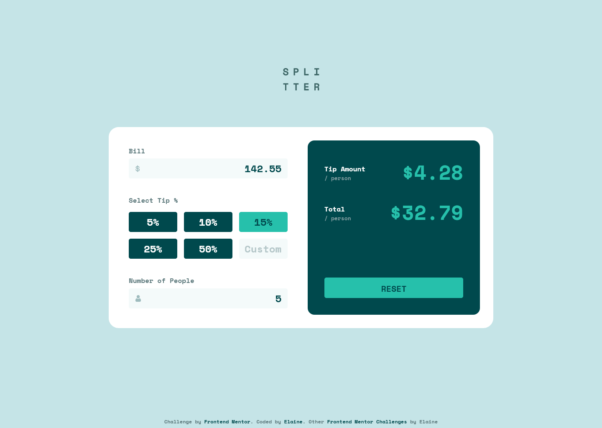

# Frontend Mentor - Tip calculator app solution

This is a solution to the [Tip calculator app challenge on Frontend Mentor](https://www.frontendmentor.io/challenges/tip-calculator-app-ugJNGbJUX). Frontend Mentor challenges help you improve your coding skills by building realistic projects.

## Table of contents

- [Overview](#overview)
  - [The challenge](#the-challenge)
  - [Screenshot](#screenshot)
  - [Links](#links)
- [My process](#my-process)
  - [Built with](#built-with)
  - [What I learned](#what-i-learned)
  - [Continued development](#continued-development)
  - [Useful resources](#useful-resources)
- [Author](#author)
- [Acknowledgments](#acknowledgments)

## Overview

### The challenge

Users should be able to:

- View the optimal layout for the app depending on their device's screen size
- See hover states for all interactive elements on the page
- Calculate the correct tip and total cost of the bill per person

### Screenshot

### Links

- Solution URL: [Link to GitHub repo](https://github.com/elaineleung/frontendmentor/tree/main/tipcalculatorapp/)
- Live Site URL: [Link to live site](https://elaineleung.github.io/frontendmentor/tipcalculatorapp/)

## My process

### Built with

- Semantic HTML5 markup
- CSS custom properties
- Flexbox
- CSS Grid
- Mobile-first workflow
- CUBE CSS
- Sass

### What I learned

In this challenge I got to revisit CSS grid, which I normally only use for simple centering and wrapping items. I also decided to use this challenge to explore a bit more about accessibility. The JS part wasn't too challenging since I've probably done more challenging things, but it was still a workout for me since I wanted to cover almost all use cases I can think of. Overall, the three biggest roadblocks I ran into was (a) struturing the elements, (b) working with radio inputs, and (c) figuring out how to maintain an optimal view while maintaining the sizes of the grid items. 

The structuring shouldn't seem so complicated; it's all because of the differences in the mobile and desktop designs and layout. In the mobile one, the white background of the app stretches to the bottom of the viewport and only the top two corners were rounded, whereas in the desktop view, it's centered and all four corners are rounded. What helped immensely was that by now I've becoming fairly proficient with aligning things with flexbox. 

With radio inputs, I almost wanted to give up and just resort to using divs because of all the inherit properties and the customizations needed. The trickiest parts where figuring out how to group the custom input with a radio button and also how to style the labels without radio buttons. I still need to figure out how it group it together when tabbing, but overall I think it's quite functional for the moment. It's quite odd that I haven't yet found a resource that showed me what to do if one of the options in the radio group is an "Other" and needed a text input. This is something I see quite often in forms, so I thought there should be some tutorial out there that shows how to write this. Maybe I need to look a bit harder because I still want to figure out how others do it.

With optimal views, `clamp()` came to the rescue again, as it helps with responsiveness and making sure I got my min and max sizes. I know the code for it looks daunting, but in the end it saves me from writing more lines in the media queries, and I'd much prefer to keep the lines down to a minimum whenever possible. 

### Continued development

One of my personal projects (that I never got finish) actually has a layout somewhat similar to this one; this project could help me with further developing that project.

### Useful resources

- [The Magic of CSS Grid AUTO-FIT vs AUTO-FILL](https://www.youtube.com/watch?v=qII5BueXWD4) - Gary did a great job explaining how to use grid; this is probably the oen video that helped me most in using grid.

- [Pure CSS Custom Styled Radio Buttons](https://moderncss.dev/pure-css-custom-styled-radio-buttons/) - Stephanie's post here helped me figure out how to hide the radio button.

- [Choice & Value Pair](https://css-tricks.com/choice-value-pair/) - This was probably the only post I found that showed how to group a radio input with a text input.

- [Radio Group Example Using Roving tabindex](https://w3c.github.io/aria-practices/examples/radio/radio.html) - This helped with styling the CSS, especially with the use of `fieldset` and `aria-labelledby`

- [Reset button](https://developer.mozilla.org/en-US/docs/Web/HTML/Element/input/reset) - I agree with MDN's stance that it's probably best to avoid using this in most use cases, but in this case the reset was especially handy

- [Prevent radio button from scrolling back up](https://stackoverflow.com/questions/24299567/radio-button-causes-browser-to-jump-to-the-top/49452792#49452792) 

## Author

- Frontend Mentor - [@elaineleung](https://www.frontendmentor.io/profile/elaineleung)
- Twitter - [@elaineclleung](https://twitter.com/elaineclleung)

## Acknowledgments

Shoutout to CSS Tricks for having so many awesome articles! Thank you also to sedcakmak for her solution, which was a great reference for me when refactoring.